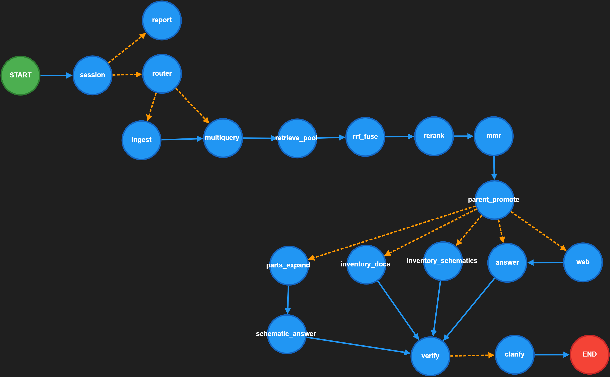

# 🔧 Hardware QA Assistant – Advanced LangGraph AI System

> AI-powered Hardware Design & Datasheet Analysis Assistant  
> Built with LangGraph, FastAPI, Gradio, ChromaDB, Vision LLM & JWT Authentication

---


## 🚀 Overview

**Hardware QA Assistant** is an advanced AI system designed to:

- Analyze hardware design questions
- Parse and index datasheets (PDF / DOCX)
- Extract structured information from schematic images (Vision LLM)
- Perform multi-query semantic retrieval (RAG v2 pipeline)
- Rerank results using Cross-Encoder
- Optionally enrich answers with live web search
- Provide execution trace & LLM inspection
- Support secure user authentication (JWT + SQLite)

This project demonstrates a **production-style AI architecture**, not just a simple chatbot.

---

## 🌐 Live Demo

🚀 Try the application live on HuggingFace Spaces:

👉 **Live Demo:** https://huggingface.co/spaces/ankarb/HW_assistant_AI_app

The demo includes:
- Per-user workspace isolation
- Multi-stage RAG pipeline
- Vision-based schematic analysis
- Execution trace visualization

---

## 🧠 System Design Perspective

This project demonstrates advanced AI system engineering concepts:

- Stateful graph orchestration using LangGraph
- Hybrid retrieval strategy (Multi-query + RRF + Cross-Encoder + MMR)
- Vision + RAG integration pipeline
- Parent-child chunk promotion
- Per-user workspace isolation
- Execution trace introspection
- Token-level LLM monitoring
- Modular architecture ready for production scaling

It is intentionally designed as a **production-style AI system**, not a simple chatbot wrapper.


## 🧠 Architecture

The system is built around a LangGraph state machine:

```
session → router → ingest → multiquery
        → retrieve_pool → rrf_fuse → rerank → mmr
        → parent_promote → (web?) → answer
        → verify → clarify | END
```

### Key Capabilities

- ✔ Multi-query retrieval
- ✔ Reciprocal Rank Fusion (RRF)
- ✔ Cross-encoder reranking
- ✔ MMR diversification
- ✔ Vision-based schematic extraction
- ✔ Parent chunk promotion
- ✔ Execution trace inspector
- ✔ LLM token usage tracking
- ✔ JWT-based authentication
- ✔ Persistent vector database (Chroma)

Architecture diagram:



---

## 🏗️ Tech Stack

| Layer | Technology |
|-------|------------|
| LLM | Groq (OpenAI-compatible API) |
| Orchestration | LangGraph |
| Vector DB | Chroma (Persistent) |
| Embeddings | Sentence-Transformers |
| Reranker | Cross-Encoder (MiniLM) |
| OCR | PaddleOCR / Tesseract |
| Vision | LLaMA Vision model |
| Web Search | Tavily |
| Backend | Gradio (HF Spaces) / FastAPI (local dev) |
| UI | Gradio |
| Auth | JWT + SQLite |
| Deployment | Uvicorn |

---

## 🔍 Feature Breakdown

### 📄 PDF / DOCX Ingestion
- Page-first extraction
- OCR fallback when needed
- Hybrid chunking
- Persistent Chroma storage

### 🖼️ Schematic Understanding
- Vision LLM extracts structured JSON
- Components & nets detected
- Datasheet expansion via RAG

### 🔎 Advanced Retrieval Pipeline
- Multi-query expansion
- RRF fusion
- Cross-encoder reranking
- MMR selection
- Parent chunk promotion

### 🧪 LLM Inspector
- Token usage tracking
- Prompt preview
- Latency metrics
- Execution trace
- DAG visualization

### 🔐 Authentication
- JWT-based sessions
- SQLite user store
- Protected `/app` routes
- Secure logout

---

## 📊 Example Use Cases

- Bias current calculation from datasheet
- LDO stability analysis
- Pin mapping verification
- Schematic functional explanation
- Datasheet parameter extraction
- Hardware design validation

---

## 🛠️ Project Structure

```
.
├── hardware_qa_assistant_lang_graph_gradio_demo_version_users.py
├── hardware_qa_assistant_helpers.py
├── secure_server.py
├── users.py
├── requirements.txt
├── langgraph-visualization.png
└── README.md
```

---

## 👨‍💻 Author

**Antonios Karvelas**  
AI Systems Engineer | Telecom Architect  

---

